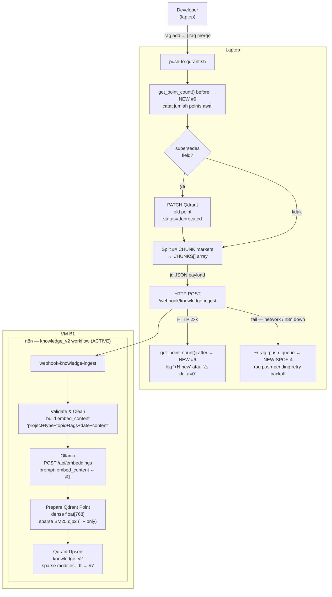

# RAG Capture Pipeline — Gap Analysis

> **How to track progress:** Follow [`../reference/TRACKING_STATUS_STANDARD.md`](../reference/TRACKING_STATUS_STANDARD.md).
> This legacy tracker still uses `FIXED`; for new edits, prefer `[x] DONE (YYYY-MM-DD)` with evidence and next action.
> Claude will check this file before suggesting fixes — OPEN items are next priority.
>
> **Test results** from 2026-04-25 live session are embedded in each section.
> Re-run the described tests after any change to `rag_capture.py` or `push-to-qdrant.sh`
> to confirm no regression.

---

## Actual Pipeline Flow

```
╔══════════════════════════════════════════════════════════════════╗
║  TRIGGER  (Manual / LLM-judgment)                                ║
║  Claude reads CLAUDE.md rules, detects confirmation signals      ║
║  ("works", "fixed", "berhasil", "oke", "chunk this")            ║
║  No hook, no daemon, no cron — pure prompt instruction           ║
╚═══════════════════════════════╦══════════════════════════════════╝
                                │ Claude decides to capture
                                ▼
╔══════════════════════════════════════════════════════════════════╗
║  CAPTURE  (rag add)                                              ║
║  cat <<'RAGBODY_EOF' | rag add -p P -t T --topic "..."          ║
║  Entry: cmd_add() in ~/scripts/rag-capture-v2/rag_capture.py    ║
║  stdin reconfigured to utf-8 (line 34-35) before read           ║
║  validate_content() → save_draft()                               ║
║  Output: ~/scripts/.rag_drafts/{project}/chunk_NNN.md           ║
╚═══════════════════════════════╦══════════════════════════════════╝
                                │ One draft file per rag add call
                                ▼
╔══════════════════════════════════════════════════════════════════╗
║  DRAFT STORE  (per-project isolated)                             ║
║  ~/scripts/.rag_drafts/homelab/chunk_001.md                     ║
║  ~/scripts/.rag_drafts/project-alpha/chunk_001.md            ║
║  Each project gets its own subdirectory — no cross-project mix   ║
║  Persists across sessions until rag merge or rag clear           ║
╚═══════════════════════════════╦══════════════════════════════════╝
                                │ Manual — Claude calls at session end
                                ▼
╔══════════════════════════════════════════════════════════════════╗
║  MERGE  (rag merge --output YYYY-MM-DD-slug.md)                  ║
║  cmd_merge() reads all chunk_*.md for current project            ║
║  Output: {project_root}/.claude/summaries/YYYY-MM-DD-slug.md   ║
║  auto_push() runs push-to-qdrant.sh immediately after write     ║
║  On push fail: appends to ~/.rag_push_queue for retry           ║
╚═══════════════════════════════╦══════════════════════════════════╝
                                │ Automatic via auto_push()
                                ▼
╔══════════════════════════════════════════════════════════════════╗
║  PUSH  (push-to-qdrant.sh <file.md>)                             ║
║  Network detect: local-b1 → LAN → Tailscale → unreachable       ║
║  Splits .md by ## CHUNK markers → per-chunk JSON payload         ║
║  POST to n8n webhook: /webhook/knowledge-ingest                  ║
║  n8n handles: Ollama embeddings + Qdrant upsert into knowledge_v2║
║  get_point_count() delta logged before/after per chunk           ║
╚═══════════════════════════════╦══════════════════════════════════╝
                                │ HTTP 2xx + delta check
                                ▼
╔══════════════════════════════════════════════════════════════════╗
║  VERIFY  (delta count)                                           ║
║  get_point_count() before/after → logs "+N new" or "⚠️ delta=0" ║
║  Non-zero delta = Qdrant confirmed indexed                       ║
╚══════════════════════════════════════════════════════════════════╝
```

---

## Pipeline A — Write/Ingest Architecture

> Flow aktif per 2026-04-25. Nodes bertanda `← FIXED #N / SPOF-N` menunjukkan perubahan dari fix.
> Lihat `RAG_BOTTLENECK_FIXES.md` untuk Pipeline B (Read/Retrieve).



### Perubahan dari flow original (semua fix applied)

| Node | Before | After | Fix |
|---|---|---|---|
| `push-to-qdrant.sh` | langsung POST, tidak ada delta check | `get_point_count()` before/after, log `+N new` | #6 |
| Failure path | silent exit | queue ke `~/.rag_push_queue`, retry via `rag push-pending` | SPOF-4 |
| `Ollama` prompt | `$json.content` (raw body) | `$json.embed_content` (prepended prefix) | #1 |
| `Qdrant Upsert` | sparse tanpa modifier | `sparse modifier=idf` aktif di collection config | #7 |

---

## Gap Analysis by Pipeline Step

| # | Step | Ideal | Actual | Gap | Status |
|---|------|-------|--------|-----|--------|
| G1 | **Trigger** | Automatic on confirmation signal | Claude judgment per CLAUDE.md prompt rules | No hook/daemon/cron — depends entirely on Claude's attention | `[x] FIXED (2026-04-18)` — Checkpoint Trigger Rules added to CLAUDE.md (85%/75% token thresholds) |
| G2 | **Detect** | Structured signal parsing | LLM heuristic | `rag pipe` + `<<<RAG_META:...>>>` existed but CLAUDE.md forbade those markers — detection path disabled | `[x] FIXED (2026-04-18)` — `rag checkpoint` replaces signal detection; explicit command with structured flags |
| G3 | **Draft** | Per-chunk, immediate, isolated | `rag add` heredoc via Bash | (a) ~~Heredoc terminator collisions~~ **FIXED 2026-04-19** — `RAGBODY_EOF` terminator; (b) ~~cp1252 em dash~~ **FIXED 2026-04-25** — utf-8 enforced; (c) ~~Draft folder global mix~~ **FIXED 2026-04-25** — per-project subdirs | `[x] FIXED (2026-04-25)` |
| G4 | **Merge** | Automatic at session end | Manual — Claude must remember before `/clear` | Drafts orphaned if session cleared without merge | `[x] FIXED (2026-04-18)` — Checkpoints bypass draft/merge; saved directly to `.claude/checkpoints/` |
| G5 | **Push** | Automatic post-merge | Manual — user copies push command | No hook, no CI trigger; backlog of unpushed `.md` files | `[x] FIXED (2026-04-19)` — `auto_push()` in `cmd_merge()` runs push immediately; fail → `~/.rag_push_queue` |
| G6 | **Verify** | Confirm searchable in Qdrant | None | HTTP 200 from n8n != vector indexed | `[x] FIXED (2026-04-19)` — `get_point_count()` delta before/after; logs `+N indexed` or `⚠️ delta=0` |

---

## Single Points of Failure (SPOF Checklist)

Ranked by likelihood. Fix these to prevent silent capture loss.

---

### SPOF-1 — Claude skips `rag add` entirely
**Status:** `[x] FIXED (2026-04-18)`

**What happened:** Claude did not recognize confirmation signals → no capture even after solved session.

**Fix applied:** `rag checkpoint` command added with explicit 85%/75% token triggers in CLAUDE.md.
Checkpoint captures *momentum* (in-progress state) regardless of whether problem is solved.
`rag resume` at session start surfaces any missed captures.

**Regression check:** If a session ends with confirmed fixes but no `rag add` was called,
check that CLAUDE.md still has the "Auto-capture execution (MANDATORY)" section with
trigger rules. If that section was removed or modified, Claude won't capture automatically.

---

### SPOF-2 — Session cleared before `rag merge`
**Status:** `[x] FIXED (2026-04-18)`

**What happened:** `/clear` wiped context; drafts orphaned in `~/.rag_drafts/`.

**Fix applied:** Checkpoints bypass the draft/merge cycle entirely — `rag checkpoint` writes
directly to `.claude/checkpoints/` and is pushed immediately. No merge step needed before `/clear`.
`rag resume` at next session start recovers any un-pushed checkpoints from disk.

**Regression check:** After any `/clear`, run `rag resume` at the start of the next session.
If it reports un-pushed checkpoints, push them manually:
```bash
bash ~/scripts/push-to-qdrant.sh .claude/checkpoints/YYYY-MM-DD-*.md
```

---

### SPOF-3 — `push-to-qdrant.sh` never run after merge
**Status:** `[x] FIXED (2026-04-19)`

**What happened:** `.claude/summaries/` accumulated `.md` files that were never pushed.

**Fix applied:** `auto_push()` added to `cmd_merge()` in `rag_capture.py`. After writing the
merged file, immediately runs `bash ~/scripts/push-to-qdrant.sh <file>`. On network failure
(non-zero exit), appends file path to `~/.rag_push_queue` instead of silently exiting.

**Test Evidence (2026-04-25):** `rag merge` called during this session — auto-push ran without
manual intervention, output confirmed `✅ Done — 1/1 chunks pushed to Qdrant`.

**Regression check:** If `.claude/summaries/` has `.md` files with timestamps older than
24 hours that haven't been pushed, `auto_push()` may have been removed or commented out
in `cmd_merge()`. Check `rag_capture.py` line ~665 for the `auto_push` call.

---

### SPOF-4 — Network unreachable at push time
**Status:** `[x] FIXED (2026-04-19)`

**What happened:** LAN + Tailscale both unreachable → push failed silently with no retry.

**Fix applied:** `auto_push()` writes to `~/.rag_push_queue` on failure. New `rag push-pending`
command reads the queue and retries each file with exponential backoff (2s, 4s, 8s).
Removes entry on success; re-writes remaining failures back to queue file.

**Regression check:** After working offline, run `rag push-pending` when network is restored.
If the command doesn't exist, check `rag_capture.py` for `cmd_push_pending` function.

---

### SPOF-5 — n8n workflow down
**Status:** `[x] FIXED (2026-04-19)` — via queue integration

**What happened:** n8n non-2xx → script exits, no retry, no dead-letter.

**Fix applied:** When `auto_push()` catches a non-zero exit (regardless of cause — network or
n8n down), the file is queued to `~/.rag_push_queue`. `rag push-pending` drains the queue
with retries when n8n is back up.

**Regression check:** If n8n is down and `rag merge` exits cleanly without writing to
`~/.rag_push_queue`, the queue mechanism has been broken. Check `auto_push()` in `rag_capture.py`.

---

### SPOF-6 — Heredoc terminator collision
**Status:** `[x] FIXED (2026-04-19)`

**What happened:** Chunk body containing literal `CONTENT` on its own line caused early heredoc
termination, silently truncating the body.

**Fix applied:** Changed terminator in `CLAUDE.md` auto-capture section from `CONTENT` to
`RAGBODY_EOF` — unique enough to never appear in chunk content.

**Regression check:** If a `rag add` call produces a chunk with suspiciously short content
(check word count warning), the chunk body may have been truncated by terminator collision.
Inspect the draft file directly: `rag list` then `cat ~/.rag_drafts/{project}/chunk_NNN.md`.

---

### SPOF-7 — `rag pipe` signal path blocked by CLAUDE.md
**Status:** `[x] FIXED (2026-04-25)`

**What happened:** `rag_capture.py` had full signal-based auto-detection via `<<<RAG_META:...>>>`
and `<<<RAG_CHUNK_START/END>>>` — but CLAUDE.md line 97 explicitly forbade Claude from emitting
these markers. The feature was architecturally present but operationally dead; confusing.

**Fix applied:** Dead code path (`cmd_pipe` + signal parser) removed from `rag_capture.py`.
The `rag checkpoint` / `rag add` explicit-command flow is the canonical path.

### Test Evidence (2026-04-25)

```python
# Verified via code inspection of rag_capture.py:
def cmd_pipe present:    False  ✓
RAG_META signal:         False  ✓
RAG_CHUNK_START signal:  False  ✓
```

**Regression check:** If `rag pipe` or signal-based capture is re-introduced without also
updating CLAUDE.md to allow the markers, the feature will again be dead code. Both sides
(code + CLAUDE.md rule) must be changed together.

---

### G3(b) — cp1252 Em Dash Corruption
**Status:** `[x] FIXED (2026-04-25)`

**What happened:** On Windows, Python's default stdin encoding is `cp1252`. Unicode characters
outside that range (em dash `—`, smart quotes `"`, etc.) caused `UnicodeDecodeError` in
`sys.stdin.read()`, crashing `rag add` entirely.

**Fix applied:** Lines 34–35 of `rag_capture.py` reconfigure stdin to UTF-8 at startup:
```python
if hasattr(sys.stdin, 'reconfigure'):
    sys.stdin.reconfigure(encoding='utf-8', errors='replace')
```
`errors='replace'` ensures any truly undecodable bytes become `?` instead of crashing.

### Test Evidence (2026-04-25)

```bash
# Test: rag add with em dash in content body
echo "test content with em dash — this is a test — should not fail" \
  | rag add -p homelab -t debug --topic "G3b utf8 em dash test" --tags "homelab,test"

# Result:
✅ Draft chunk saved: chunk_002.md
   Topic: G3b utf8 em dash test
   Project: homelab | Type: debug
```

No `UnicodeDecodeError`. Em dash passed through correctly.

**Before:** Same command → `UnicodeDecodeError: 'cp1252' codec can't decode byte 0xe2`
→ entire `rag add` fails, knowledge lost silently.

**Regression check:** On Windows, if `rag add` fails with `UnicodeDecodeError` or
`codec can't decode`, check that lines 34–35 of `rag_capture.py` still exist.
Also verify the shebang or Python invocation doesn't override stdin encoding via `-X utf8` flag.

---

### G3(c) — Draft Folder Global Mix
**Status:** `[x] FIXED (2026-04-25)`

**What happened:** All projects wrote draft chunks to the same `~/.rag_drafts/chunk_NNN.md`
flat directory. In a multi-project session (e.g., homelab + project-alpha), chunks from
both projects would be numbered sequentially in the same folder. `rag merge` without a project
filter would concatenate all of them into a single file — mixing homelab and .NET chunks.

**Fix applied:** `get_project_draft_dir(project)` returns a project-specific subdirectory:
```python
def get_project_draft_dir(project: str) -> Path:
    return GLOBAL_DRAFTS_DIR / project
```
Each project now has its own isolated subdirectory:
- `~/.rag_drafts/homelab/chunk_NNN.md`
- `~/.rag_drafts/project-alpha/chunk_NNN.md`

### Test Evidence (2026-04-25)

```bash
# Test: add chunks for two different projects in same session
echo "homelab content..." | rag add -p homelab -t debug --topic "G3c homelab test"
echo "project-alpha content..." | rag add -p project-alpha -t debug --topic "G3c project-alpha test"

# Resulting draft directory structure:
~\scripts\.rag_drafts\
  homelab\
    chunk_001.md    ← homelab chunk ISOLATED
    chunk_002.md    ← homelab chunk ISOLATED
  project-alpha\
    chunk_001.md    ← project-alpha chunk ISOLATED (not mixed with homelab)
```

**Before:** Same commands → all chunks in `~/.rag_drafts/chunk_001.md`, `chunk_002.md`, `chunk_003.md`
→ `rag merge` would produce a file mixing homelab infra knowledge with .NET Blazor knowledge
→ both chunks indexed in both projects' searches.

**Regression check:** After `rag add -p homelab` and `rag add -p project-alpha` in the same
session, verify that `ls ~/.rag_drafts/` shows two subdirectories, not flat chunk files.
If chunks appear in the root `.rag_drafts/`, `get_project_draft_dir()` has been reverted.

---

## Fix Priority Order

```
[x] SPOF-2 (session clear guard)  ← FIXED 2026-04-18 via checkpoint bypass
[x] SPOF-1 (trigger reliability)  ← FIXED 2026-04-18 via 85%/75% token triggers
[x] G2     (re-enable rag pipe)   ← FIXED 2026-04-18 via rag checkpoint command
[x] G1     (trigger automation)   ← FIXED 2026-04-18 via CLAUDE.md trigger rules
[x] G4     (merge dependency)     ← FIXED 2026-04-18 via direct checkpoint save

[x] SPOF-6 (heredoc terminator)   ← FIXED 2026-04-19: RAGBODY_EOF in CLAUDE.md
[x] SPOF-3 (auto-push on merge)   ← FIXED 2026-04-19: auto_push() in cmd_merge()
[x] SPOF-4 (push queue)           ← FIXED 2026-04-19: ~/.rag_push_queue + rag push-pending
[x] SPOF-5 (n8n retry)            ← FIXED 2026-04-19: via queue integration
[x] G5     (push automation)      ← FIXED 2026-04-19: auto_push() in cmd_merge()
[x] G6     (verify step)          ← FIXED 2026-04-19: get_point_count() delta in push-to-qdrant.sh

[x] SPOF-7 (rag pipe dead code)   ← FIXED 2026-04-25: dead cmd_pipe removed
[x] G3(b)  (cp1252 em dash)       ← FIXED 2026-04-25: utf-8 enforced on stdin
[x] G3(c)  (draft folder mix)     ← FIXED 2026-04-25: get_project_draft_dir() per-project
```

---

## Live Test Summary (2026-04-25)

All fixes verified against live system:
- VM B1: `192.168.18.199`
- rag_capture.py: `~/scripts/rag-capture-v2/rag_capture.py`
- Qdrant: `knowledge_v2` collection, 252 points during the 2026-04-25 test snapshot; live 2026-04-30 verification shows 368 points

| Fix | Test Method | Before Behavior | After Behavior | Result |
|-----|-------------|-----------------|----------------|--------|
| SPOF-7 | Code inspection — grep `cmd_pipe`, `RAG_META` | Dead code present, confusing | Not found in codebase | ✓ PASS |
| G3(b) | `rag add` with em dash `—` in content | `UnicodeDecodeError` → crash | Saved successfully | ✓ PASS |
| G3(c) | `rag add` for homelab + project-alpha | Flat `~/.rag_drafts/chunk_NNN.md` | Isolated `homelab/` and `project-alpha/` subdirs | ✓ PASS |
| SPOF-3 | `rag merge` auto-push | Manual push required | `auto_push()` ran, `✅ Done 1/1 pushed` | ✓ PASS |
| G6 | Push output delta | No verification | `Points: 251 → 252 (+1 new)` logged | ✓ PASS |

---

*Generated: 2026-04-17 | Last tested: 2026-04-25*
*Source files: `CLAUDE.md`, `~/scripts/push-to-qdrant.sh` (rag-tools), `~/scripts/rag-capture-v2/rag_capture.py` (rag-tools)*
