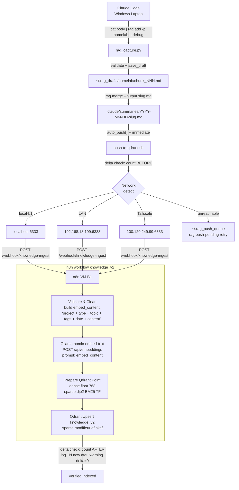
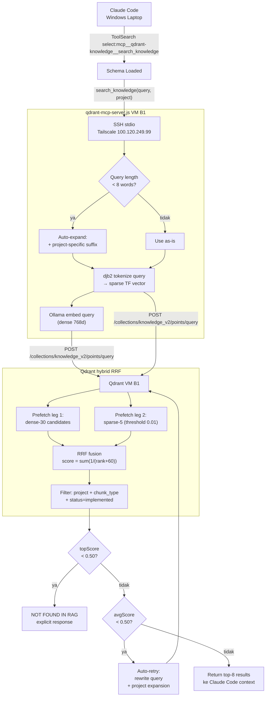

# RAG Manual Book

**Sistem:** `knowledge_v2` on VM B1 (192.168.18.199)
**Last updated:** 2026-04-30
**Author:** Figur Ulul Azmi

> Dokumen ini adalah referensi pribadi jangka panjang untuk sistem RAG yang saya bangun sendiri.
> Ditulis berdasarkan ground truth dari RAG knowledge base + docs aktif di repo ini.
> Bukan marketing copy -- ini untuk saya yang sudah tahu konteksnya.
>
> Quick companion: `README.md` untuk quickstart, setup, dan ringkasan API/config.
> Manual ini adalah operasional deep-dive (session protocol, chunk taxonomy, troubleshooting, eval).

---

## Daftar Isi

1. [Mengapa RAG?](#1-mengapa-rag)
2. [Cara Kerja Sistem Ini](#2-cara-kerja-sistem-ini)
3. [Fitur yang Tersedia](#3-fitur-yang-tersedia)
4. [Workflow Harian](#4-workflow-harian)
5. [Chunk Type Guide](#5-chunk-type-guide)
6. [CLI Reference](#6-cli-reference)
7. [Troubleshooting](#7-troubleshooting)
8. [Eval Framework](#8-eval-framework)

---

## 1. Mengapa RAG?

### Problem Sebelum RAG

Sebelum ada sistem ini, setiap kali saya mulai sesi baru di Claude Code untuk mengerjakan sesuatu yang pernah saya kerjakan sebelumnya, saya harus menjelaskan ulang konteksnya dari awal, atau Claude membaca source files yang mungkin tidak relevan. Biayanya mahal:

| Skenario | Tanpa RAG | Dengan RAG |
|---|---|---|
| "Bagaimana cara redeploy ke VM B1?" | Claude baca 5-10 file, baru bisa jawab | 1 query → chunk `runbook` langsung |
| "Kenapa hybrid RRF dipilih?" | Claude tebak dari kode | `decision` chunk berisi rationale |
| "Error Qdrant 400 kemarin gimana fixnya?" | Tidak bisa tahu -- tidak ada memori cross-session | `debug` chunk berisi root cause + fix |
| Resume sesi yang interrupted | 3,000-8,000 token re-exploration | `rag resume` → 400-800 token precision read |

**Root problem:** Claude tidak punya memori lintas sesi. Setiap `/clear` atau sesi baru = blank slate.

### Solusi: Knowledge Base External Brain

RAG menjadikan Qdrant sebagai "otak eksternal" -- semua pengetahuan yang sudah pernah saya dapatkan dari debugging, membuat fitur, atau mengambil keputusan arsitektur, bisa di-retrieve oleh Claude di sesi berikutnya dalam hitungan detik.

### Mengapa Hybrid RRF?

Cosine-only semantic search bagus untuk query konseptual, tapi gagal untuk:
- Error codes yang persis (`422`, `UnicodeDecodeError`)
- Config keys (`SCORE_THRESHOLD`, `SparsePrefetchLimit`)
- Port numbers (`6333`, `5678`, `11434`)
- Command names (`docker compose`, `djb2`, `modifier=idf`)

BM25 sparse catches exact-match queries yang missed oleh cosine. RRF fusion mengkombinasikan keduanya tanpa harus tune weights manual.

### Mengapa Qdrant?

- Self-hosted di VM B1 -- tidak ada data keluar jaringan
- Native hybrid search (RRF) server-side sejak v1.15.2
- Named vectors untuk dense + sparse dalam satu collection
- Server-side BM25 sparse inference (tidak perlu client-side tokenizer untuk retrieval)
- Filter by payload field (project, chunk_type, status)

---

## 2. Cara Kerja Sistem Ini

### Komponen

| Komponen | Lokasi | Role |
|---|---|---|
| `rag_capture.py` | `~/scripts/rag-capture-v2/` (Windows laptop) | CLI untuk capture, checkpoint, merge |
| `push-to-qdrant.sh` | `~/scripts/push-to-qdrant.sh` (Windows laptop) | Ingest pipeline: split chunks, POST ke n8n |
| n8n workflow `knowledge_v2` | VM B1 port 5678 | Validate, embed_content prepend, Ollama embed, Qdrant upsert |
| Ollama `nomic-embed-text` | VM B1 port 11434 | Dense embedding model (768 dimensions) |
| Qdrant `knowledge_v2` | VM B1 port 6333 | Vector store: dense (768d) + sparse (djb2 BM25) |
| `qdrant-mcp-server.js` | VM B1 `/opt/rag-tools/mcp-server/` | MCP server untuk Claude Code sessions |
| `rag-gateway-mini` | VM B1 port 5200 | ASP.NET Core 9 REST API; `/rag/search` + `/rag/debug` |

### 2A -- Ingest Flow



**Kunci ingest flow:**
- `rag add` saves draft ke per-project subdirectory (`~/.rag_drafts/homelab/` tidak tercampur dengan `project-alpha/`)
- `rag merge` langsung trigger `auto_push()` -- tidak perlu manual push
- `push-to-qdrant.sh` auto-detect network: localhost kalau di VM B1, LAN kalau di rumah, Tailscale kalau remote
- n8n builds `embed_content` = prepend context + raw content -- dense vector embed-nya ini, bukan raw content (P1.2 contextual retrieval)
- Sparse vector di-generate oleh Qdrant server-side dengan `modifier=idf` -- client hanya kirim TF

### 2B -- Retrieval Flow



**Kunci retrieval flow:**
- MCP server spawn fresh per-connection via `claude-mcp-connect.ps1` -- tidak perlu restart manual
- Query expansion untuk queries < 8 kata adalah project-aware (homelab vs project-alpha berbeda)
- NOT_FOUND gate: topScore < 0.50 = genuinely not found, bukan threshold artifact
- SCORE_THRESHOLD = 0.35: per-result inclusion threshold (RRF scores range lower dari cosine)
- Auto-retry: avgScore < 0.50 triggers query rewrite + retry satu kali

### Arsitektur 3-Collection

| Collection | Purpose | Status field | Route |
|---|---|---|---|
| `knowledge_v2` | Solved problems, implemented features, patterns | `implemented` / `solved` | Default |
| `checkpoints` | In-progress session snapshots | `in_progress` | via `collection: checkpoints` di frontmatter |
| `architecture` | Permanent ADR decisions | `stable` | manual |

`push-to-qdrant.sh` membaca field `collection:` dari frontmatter untuk routing. Default ke `knowledge_v2` kalau field tidak ada.

### Contextual Prepend (P1.2)

Sebelum P1.2, n8n embed raw content sedangkan RAG Gateway embed raw query. Hasilnya:
`cosine(stored_vector, embed(raw_query)) = 0.728` -- query vectors 27% off dari posisi stored vectors.

Setelah P1.2:
- n8n builds `embed_content = "This chunk is from project homelab, type debug, topic 'Fix Qdrant zero results', tagged homelab,vm-b1. Session date 2026-04-25. Content: [body]"`
- RAG Gateway builds `queryEmbedContent = "This chunk is from project homelab. Content: [query]"`
- Keduanya embed versi yang matching → cosine naik ke 0.75-1.00

Impact: Hit@1 naik 0.60 → 1.00, MRR naik 0.65 → 1.00 setelah corpus re-ingest.

---

## 3. Fitur yang Tersedia

### 3.1 Hybrid RRF Retrieval

Dense semantic search + sparse BM25 keyword search, di-fuse server-side dengan RRF. Tidak perlu tune weights manual.

```bash
# Dense excels: conceptual queries
search_knowledge("mengapa deployment gagal silently di VM B1", project="homelab")

# Sparse excels: exact keyword queries
search_knowledge("SCORE_THRESHOLD 0.35 RRF cosine config", project="homelab")

# Hybrid handles both
search_knowledge("docker compose v2 space not hyphen VM B1", project="homelab")
```

Config key di `appsettings.Production.json` (VM B1 volume mount):
```json
"SparsePrefetchLimit": 5,
"SparseScoreThreshold": 0.01,
"HybridPrefetchLimit": 30,
"ResultLimit": 8,
"ScoreThreshold": 0.35
```

> **Warning:** kedua file `appsettings.json` (repo) dan `appsettings.Production.json` (VM B1 volume mount) harus diupdate bersamaan saat ada perubahan config.

### 3.2 chunk_type Filter

Filter retrieval ke type tertentu untuk precision tinggi:

```
search_knowledge("implementasi RAG hybrid search", project="homelab", chunk_type="implementation-spec")
```

Kalau tidak ditemukan dengan filter, fall back ke tanpa filter.

Tersedia: `debug` | `feature` | `runbook` | `pattern` | `decision` | `reference` | `implementation-spec`

### 3.3 NOT_FOUND Gate

Top score < 0.50 = Claude output explicit "NOT FOUND IN RAG" dan tidak silently fall back ke training data.

```
NOT_FOUND_THRESHOLD = 0.50  # topScore < ini = not found
SCORE_THRESHOLD = 0.35      # per-result inclusion (results dengan score 0.35-0.49 tetap disertakan)
```

Perbedaan penting: `SCORE_THRESHOLD` = batas minimum untuk include hasil. `NOT_FOUND_THRESHOLD` = batas untuk declare bahwa informasi genuinely tidak ada di knowledge base.

### 3.4 Auto-Retry dengan Project-Aware Expansion

Kalau `avgScore < 0.50` setelah retrieval pertama, MCP server otomatis:
1. Rewrite query dengan project-specific expansion terms
2. Retry satu kali ke Qdrant

Expansion strings per project:
```javascript
const expansions = {
  "homelab": "deployment configuration setup steps homelab VM B1 Docker infrastructure",
  "project-alpha": "Blazor .NET 9 EF Core CQRS MediatR implementation pattern C#",
};
```

### 3.5 Project Isolation

`project="homelab"` dan `project="project-alpha"` tidak pernah tercampur. Filter payload di setiap Qdrant query.

Draft files juga isolated per-project: `~/.rag_drafts/homelab/` vs `~/.rag_drafts/project-alpha/`.

### 3.6 Query Normalization

Whitespace-only normalization -- tidak ada padding. Short queries (< 8 kata) bekerja dengan baik karena padding dulu justru menambah noise.

> Aturan "minimum 8 kata" adalah guideline untuk manusia yang menulis queries, bukan constraint retrieval.

### 3.7 Push Queue + Auto-Push

Setelah `rag merge`, `auto_push()` langsung push ke Qdrant. Kalau network unreachable:
- File path append ke `~/.rag_push_queue`
- `rag push-pending` retries dengan exponential backoff: 0s, 2s, 4s, 8s (4 attempts total)
- Upsert idempotent (deterministic chunk ID `{DOC_ID}-chunk-{N}`) -- safe to re-push

```bash
# Manual retry setelah network kembali
rag push-pending
```

### 3.8 Checkpoint / Resume

Untuk sesi panjang yang interrupted atau token limit approaching.

**Checkpoint (simpan momentum):**
```bash
cat <<'RAGCHK' | rag checkpoint -p homelab --topic "Fix Qdrant sparse noise" \
  --next-step "src/Infrastructure/AI/QdrantVectorSearchClient.cs:89 — ubah SparsePrefetchLimit" \
  --hypothesis "Sparse BM25 noise karena SparsePrefetchLimit terlalu besar" \
  --trigger "85%"
### Problem
Sparse BM25 returning noisy results, RRF poisoned.
### Progress
Diagnosed: SparsePrefetchLimit=20 terlalu besar untuk KB 200 docs.
Fix identified: reduce to 5 + add SparseScoreThreshold=0.01.
### Key Facts
- SparsePrefetchLimit=5 adalah fix yang sudah divalidasi di eval
- SparseScoreThreshold=0.01 filter flat-IDF results sebelum RRF
- appsettings.Production.json di VM B1 harus diupdate juga
RAGCHK
```

Saves ke `.claude/checkpoints/YYYY-MM-DD-slug-001.md` langsung. Tidak perlu draft-merge cycle. Token budget: ~1100-1500 (standard) atau ~300 (--quick).

**Resume (sesi berikutnya):**
```bash
rag resume
```

Output:
```
OPEN CHECKPOINTS (1) -- load before file exploration

  Topic      : Fix Qdrant sparse noise
  Next step  : src/Infrastructure/AI/QdrantVectorSearchClient.cs:89
  Hypothesis : Sparse BM25 noise karena SparsePrefetchLimit terlalu besar
  RTK reads  : rtk read src/Infrastructure/AI/QdrantVectorSearchClient.cs
  Promote    : rag promote --file .claude/checkpoints/2026-04-25-...md
```

Kalau FOUND: skip Glob/Grep exploration, langsung execute RTK reads + next_step. Saves 75-90% tokens vs broad exploration.

### 3.9 rag promote

Convert checkpoint yang sudah solved ke permanent knowledge:

```bash
rag promote --file .claude/checkpoints/2026-04-25-fix-qdrant-sparse-001.md
bash ~/scripts/push-to-qdrant.sh .claude/summaries/2026-04-25-fix-qdrant-sparse-promoted.md
```

Promote sets: `status: solved`, `collection: knowledge_v2`, `parent_id` linking ke original checkpoint. Original checkpoint file diupdate ke `status: solved` untuk audit trail.

### 3.10 Status Filter

Default MCP query hanya return chunks dengan `status=implemented`. Untuk include planned/draft:
```
search_knowledge("...", project="homelab", include_planned=True)
```

Whitelist status yang valid: `implemented` | `planned` | `deprecated` | `solved` | `in_progress` | `stable`.

Chunks dengan `status=deprecated` tidak pernah return di default queries -- dipakai oleh `supersedes` mechanism.

### 3.11 Deterministic Chunk ID

Setiap chunk mendapat ID `{DOC_ID}-chunk-{N}`. `DOC_ID` di-derive dari frontmatter fields (date + topic slug). Ini membuat semua upsert idempotent -- re-push file yang sama tidak akan duplicate chunks.

### 3.12 feature_slug Cross-Chunk Linking

Satu feature biasanya span beberapa chunk types (feature + decision + runbook + debug + pattern). Untuk retrieve semua sekaligus:

```bash
curl -X POST http://192.168.18.199:5200/rag/search \
  -H "Content-Type: application/json" \
  -d '{"query":"hybrid search implementation","project":"homelab","feature_slug":"2026-04-08-hybrid-search-refactor"}'
```

Tanpa `feature_slug`: butuh 5+ queries per chunk_type, mungkin dapat doc yang salah. Dengan `feature_slug`: 1 call, semua 8 chunks dari satu feature, semua chunk types terwakili.

### 3.13 Supersede / Deprecate Semantics

Kalau ada knowledge yang sudah obsolete, capture chunk baru dengan:
```yaml
supersedes: 2026-03-10-old-decision-cosine-only-001
```

`push-to-qdrant.sh` akan PATCH old chunk di Qdrant ke `status: deprecated` sebelum upsert chunk baru. Old chunk otomatis hilang dari default queries (MCP server filter `status=implemented`).

---

## 4. Workflow Harian

### 4.1 Session Start (WAJIB -- setiap sesi)

**Urutan ini mandatory, jangan dibalik:**

```bash
# Step 1 -- cek open checkpoint dulu
rag resume

# Output FOUND? → skip exploration, langsung execute RTK reads dari output resume
# Output EMPTY? → lanjut ke step 2
```

```
# Step 2 -- load Qdrant schema (deferred tool, harus di-load manual setiap sesi)
ToolSearch select:mcp__qdrant-knowledge__search_knowledge
```

```
# Step 3 -- query RAG SEBELUM baca source files
search_knowledge("kata kunci dari masalah yang akan dikerjakan", project="homelab")
```

```bash
# Step 4 -- baru baca file spesifik yang ditunjuk RAG
rtk read src/Infrastructure/AI/QdrantVectorSearchClient.cs
```

Kalau langsung ke Step 4 tanpa Step 1-3, bisa waste 3K-8K tokens re-exploring apa yang sudah pernah saya kerjakan.

### 4.2 Debug Session

1. Debug sampai masalah solved dan dikonfirmasi ("works", "fixed", "berhasil")
2. Capture debug chunk
3. **Wajib:** capture companion pattern chunk ("apa prinsip yang bisa saya ambil dari fix ini?")

```bash
# Debug chunk
cat <<'EOF' | rag add -p homelab -t debug \
  --topic "Fix Qdrant SparsePrefetchLimit noise" \
  --tags "homelab,vm-b1,qdrant,sparse,fixed"
### Context
Hybrid RRF retrieval on knowledge_v2 returning noisy results for keyword queries.
### Problem
SparsePrefetchLimit=20 too large for homogeneous KB < 200 docs. IDF discrimination flat.
All docs get similar sparse scores, poisoning RRF fusion.
### Solution
Set SparsePrefetchLimit=5 + SparseScoreThreshold=0.01 in appsettings.Production.json.
Asymmetric prefetch: dense-30 (more candidates) + sparse-5 (fewer, higher quality).
### Key Facts
- SparsePrefetchLimit=5 reduces sparse influence without disabling hybrid
- SparseScoreThreshold=0.01 filters flat-IDF results before RRF fusion
- Both appsettings.json AND appsettings.Production.json must be updated
EOF

# Companion pattern chunk -- wajib setelah setiap debug
cat <<'EOF' | rag add -p homelab -t pattern \
  --topic "Pattern: sparse BM25 prefetch limit tuning for small KB" \
  --tags "homelab,qdrant,bm25,hybrid-search,pattern"
### Context
Qdrant hybrid RRF search on a homogeneous knowledge base under 200 documents.
### Pattern
Set SparsePrefetchLimit to 5 percent of total docs and SparseScoreThreshold=0.01
when KB is smaller than 200 documents. Hybrid benefit appears only at 500+ diverse docs.
### When to Apply
Whenever hybrid search returns unexpected results on a small KB. Check if sparse is
returning flat-score results by querying sparse-only and inspecting score distribution.
### Anti-Pattern
DO NOT set SparsePrefetchLimit equal to dense prefetch limit for small homogeneous KB.
Sparse quality degrades faster than dense at small scale.
### Key Facts
- Hybrid benefit over dense-only appears at 500+ topically diverse documents
- djb2 IDF discrimination too flat for < 200 docs in same domain
- SparsePrefetchLimit:DensePrefetchLimit ratio 5:30 works well in practice
EOF
```

**Anti-pattern:** hanya capture debug chunk tanpa pattern companion = pengetahuan tetap dalam format "incident report", bukan reusable rule. Ratio target debug:pattern = 2:1 (bukan 8:1 saat ini).

### 4.3 Feature Session

1. Feature shipped end-to-end
2. Capture feature chunk dengan `### Target Files` (required oleh validator)
3. Kalau ada keputusan arsitektur, capture decision chunk terpisah

```bash
# Feature chunk
cat <<'EOF' | rag add -p homelab -t feature \
  --topic "Feature: query normalization remove padding" \
  --tags "homelab,rag-gateway,retrieval,dotnet"
### Context
rag-gateway-mini ASP.NET Core 9 on VM B1. QueryNormalizer was padding short queries
with generic terms to reach 8-word minimum.
### Requirements
Short queries (2 words) must work correctly without semantic noise from padding.
### Architecture Decision
Remove padding entirely. 8-word minimum is a human writing guideline, not a retrieval
constraint. Short precise queries outperform padded long queries empirically.
### Implementation
QueryNormalizer.Normalize() now only collapses whitespace. Removed WordCount check.
### Target Files
- src/Infrastructure/Helpers/QueryNormalizer.cs
### Key Facts
- 2-word queries now return top-1 score >= 0.61 (above 0.35 threshold)
- Padding shifted dense embedding away from true query intent
- No minimum word count for retrieval -- only for human-written knowledge chunks
EOF
```

### 4.4 Code-Gen Session (BLOCKED sampai P2.2-B reranker)

Ketika P2.2-B (TEI + BGE-reranker) sudah deployed:

```
# Query dengan impl-spec filter dulu
search_knowledge("implementasikan RAG hybrid search client endpoint", project="homelab", chunk_type="implementation-spec")

# Kalau tidak found, fall back ke unfiltered
search_knowledge("implementasikan RAG hybrid search client endpoint", project="homelab")

# Feed hasil ke implementer model
# qwen2.5-coder via Ollama: POST http://192.168.18.199:11434/api/generate
```

Saat ini: 0 `implementation-spec` chunks. Jangan aktifkan workflow ini sebelum P2.2-B selesai.

### 4.5 Session End

**Normal end:**

```bash
# 1. Merge semua draft chunks jadi satu file
rag merge --output 2026-04-25-sesi-hari-ini.md
# auto_push() langsung jalan, push ke Qdrant

# 2. Kalau ada chunk yang belum sempat di-add, tambahkan sekarang
cat <<'EOF' | rag add -p homelab -t debug --topic "..." --tags "..."
# ...
EOF
rag merge --output 2026-04-25-tambahan.md

# 3. Cek push queue kalau ada yang gagal
rag push-pending
```

**Token limit approaching (85%):**

```bash
# Standard checkpoint
cat <<'RAGCHK' | rag checkpoint -p homelab \
  --topic "slug-masalah-yang-dikerjakan" \
  --next-step "file.py:line_number -- exact action" \
  --hypothesis "teori yang sedang ditest" \
  --trigger "85%"
### Problem
[satu paragraf tentang masalah]
### Progress
[apa yang sudah dikerjakan sesi ini]
### Key Facts
- fact 1 yang atomic dan searchable
- fact 2
- fact 3
RAGCHK

# Push checkpoint segera
bash ~/scripts/push-to-qdrant.sh .claude/checkpoints/$(date +%Y-%m-%d)-*.md
```

**Emergency (< 5% tokens tersisa):**

```bash
rag checkpoint -p homelab --topic "slug" --next-step "file.cs:line" --trigger "75%" --quick
```

**After problem solved (promote checkpoint ke knowledge):**

```bash
rag promote --file .claude/checkpoints/2026-04-25-slug-001.md
bash ~/scripts/push-to-qdrant.sh .claude/summaries/2026-04-25-slug-promoted.md
```

---

## 5. Chunk Type Guide

### Tabel Lengkap

| Type | Kapan Dipakai | Contoh Topik | Sinyal Trigger | Required Sections |
|---|---|---|---|---|
| `debug` | Bug fix dikonfirmasi | "Fix Qdrant zero results after collection migration" | "works", "fixed", "berhasil", "oke" | Context, Problem, Solution, Key Facts, Code, Caveats |
| `feature` | Fitur selesai ship end-to-end | "RAG auto-capture toolchain rag_capture.py + push-to-qdrant.sh" | Fitur bisa digunakan tanpa error | Context, Requirements, Architecture Decision, Implementation, Key Facts, **Target Files** |
| `runbook` | Prosedur step-by-step dengan verifikasi | "Redeploy rag-gateway-mini ke VM B1 via Docker Compose" | Prosedur selesai dijalankan dan diverifikasi | Context, Prerequisites, Steps, Verification, Key Facts |
| `pattern` | Aturan reusable yang bisa mencegah bug di masa depan | "Pattern: RRF scores require lower threshold than cosine similarity" | Setiap kali selesai debug chunk | Context, Pattern (the rule), When to Apply, Anti-Pattern, Key Facts |
| `decision` | Pilihan arsitektur dengan rationale lengkap | "Decision: hybrid RRF dense+sparse over cosine-only for knowledge_v2" | Memilih antara >= 2 opsi dengan tradeoff | Context, Decision Required, Options Considered, Decision, Rationale, Consequences, Key Facts |
| `reference` | Data faktual: config maps, topology, port tables | "VM B1 infrastructure topology: services, IPs, ports" | Ada config atau topologi yang sering dicari | Context, Content (tabel/list), Key Facts |
| `implementation-spec` | Spec code-gen untuk implementer model | "RAG Gateway hybrid search implementation spec" | **BLOCKED** -- aktifkan setelah P2.2-B | Target Files, Interfaces, Dependencies, Contract, Anti-Patterns, Verification, Key Facts |

### Pohon Keputusan

```
Apa yang baru terjadi?
  |
  +-- Error/bug solved? → debug
  |
  +-- Fitur bisa dipakai? → feature (+ decision kalau ada architectural choice)
  |
  +-- Menjalankan prosedur operasional? → runbook
  |
  +-- Setelah debug, ada prinsip yang bisa diextract? → pattern
  |
  +-- Pilih antara opsi A vs B dengan reasoning? → decision
  |
  +-- Mencatat data faktual (config, port, path)? → reference
  |
  +-- Nulis spec untuk code-gen? → implementation-spec (BLOCKED)
```

### Distribution Target vs Aktual

| Type | Target | Aktual (2026-04-25) | Status |
|---|---|---|---|
| `debug` | 35-40% | 58% | Masih over-indexed |
| `pattern` | 20-25% | 7% | Perlu terus ditambah |
| `feature` | 15-20% | 10% | Mendekati target |
| `runbook` | 10-15% | 7% | OK |
| `decision` | 8-10% | 6% | Mendekati target |
| `reference` | 5-8% | 2% | Masih kurang |
| `implementation-spec` | 3-5% | 0% | BLOCKED |

**Aturan praktis:** Setiap kali capture `debug` chunk, tanya: "Apa prinsip reusable-nya?" dan capture companion `pattern` chunk. Target ratio debug:pattern = 2:1.

### Field yang Wajib vs Opsional

```bash
# Wajib untuk semua chunk types:
-p PROJECT     # homelab atau project-alpha
-t TYPE        # lihat tabel di atas
--topic        # max 60 chars, plain ASCII, no em dash
--tags         # first tag HARUS: dotnet | python | homelab

# Wajib untuk feature dan pattern:
### Target Files   # repo-relative paths

# Wajib untuk implementation-spec (semua section berikut):
### Target Files
### Interfaces
### Dependencies
### Contract
### Anti-Patterns
### Verification
### Key Facts   # minimum 3, masing-masing independently searchable

# Hard-reject kalau missing (validator akan exit 1):
- Word count < 100 atau > 400
- ### Key Facts tidak ada
- Em dash (--) di dalam content
- implementation-spec tanpa salah satu required section
- feature/pattern tanpa ### Target Files
```

---

## 6. CLI Reference

### `rag add` -- Draft Satu Chunk

```bash
cat <<'RAGBODY_EOF' | rag add -p PROJECT -t TYPE --topic "Judul chunk max 60 chars" --tags "tag1,tag2,tag3"
### Context
[1-2 kalimat. Self-contained. Sistem apa, goal apa, constraint apa.]
### Problem
[Masalah, error, requirement yang spesifik.]
### Solution
[Fix, keputusan, implementasi aktual. Be specific.]
### Key Facts
- [Fact 1 yang atomic dan bisa dicari secara independen]
- [Fact 2]
- [Fact 3]
### Code
[Opsional. Snippet saja, bukan full file.]
RAGBODY_EOF
```

**Aturan heredoc:**
- Terminator `RAGBODY_EOF` -- jangan pakai `CONTENT` atau kata yang mungkin muncul di body
- Jangan include `## CHUNK N:` header di body -- `rag_capture.py` auto-prepend-nya
- Jangan pakai em dash (`--`) di dalam body -- Windows cp1252 encoding crash

**Output:**
```
Draft chunk saved: chunk_001.md
  Topic: Judul chunk max 60 chars
  Project: homelab | Type: debug
```

---

### `rag merge` -- Gabungkan Drafts Jadi Final File

```bash
rag merge --output 2026-04-25-sesi-debug-qdrant.md
```

**Apa yang terjadi:**
1. Baca semua `~/.rag_drafts/{project}/chunk_NNN.md`
2. Merge jadi satu file di `.claude/summaries/`
3. Auto-generate SESSION METADATA header
4. Langsung trigger `auto_push()` ke `push-to-qdrant.sh`
5. Kalau push gagal: append ke `~/.rag_push_queue`
6. Print push command ke stdout untuk manual run kalau diperlukan

**Output push reminder:**
```
Pushing to Qdrant...
Points: 295 → 296 (+1 new)
Done -- 1/1 chunks pushed
```

---

### `rag checkpoint` -- Simpan Progress Mid-Session

```bash
# Standard (trigger: 85%)
cat <<'RAGCHK' | rag checkpoint -p homelab \
  --topic "slug-masalah-max-60-chars" \
  --next-step "src/X.cs:89 -- ubah SparsePrefetchLimit" \
  --hypothesis "Sparse noise karena prefetch terlalu besar" \
  --trigger "85%"
### Problem
[satu paragraf]
### Progress
[apa yang sudah dikerjakan]
### Key Facts
- fact 1
- fact 2
- fact 3
RAGCHK

# Emergency (trigger: 75% atau < 5% tokens)
rag checkpoint -p homelab \
  --topic "slug" \
  --next-step "file.cs:line" \
  --trigger "75%" \
  --quick
```

**Flags:**

| Flag | Required | Deskripsi |
|---|---|---|
| `-p PROJECT` | Ya | `homelab` atau `project-alpha` |
| `--topic` | Ya | Max 60 chars ASCII |
| `--next-step` | Ya | Harus spesifik: `file.cs:line` |
| `--hypothesis` | Tidak | Current working theory |
| `--blocking` | Tidak | Unanswered blocker question |
| `--trigger` | Tidak | `85%` / `75%` / `manual` / `session_end` |
| `--quick` | Tidak | Skip body, ~300 tokens emergency mode |

Setelah checkpoint, **langsung push**:
```bash
bash ~/scripts/push-to-qdrant.sh .claude/checkpoints/$(date +%Y-%m-%d)-*.md
```

---

### `rag resume` -- Session Start Protocol

```bash
rag resume              # semua projects
rag resume -p homelab   # filter by project
```

**Kalau FOUND:** skip semua Glob/Grep exploration. Execute hanya RTK reads dari output, lalu `next_step`.

**Kalau EMPTY:** lanjut ke normal RAG-first protocol (ToolSearch + search_knowledge).

---

### `rag promote` -- Convert Checkpoint ke Knowledge

```bash
rag promote --file .claude/checkpoints/2026-04-25-slug-001.md
# opsional: --output custom-name.md

# Lalu push ke knowledge_v2
bash ~/scripts/push-to-qdrant.sh .claude/summaries/2026-04-25-slug-promoted.md
```

**Yang dilakukan promote:**
- Set `status: solved`, `collection: knowledge_v2`
- Set `parent_id` linking ke original checkpoint
- Write ke `.claude/summaries/`
- Update original checkpoint file ke `status: solved`

---

### `rag push-pending` -- Retry Failed Pushes

```bash
rag push-pending
```

Reads `~/.rag_push_queue`, retries dengan exponential backoff: 0s, 2s, 4s, 8s.
Remove entry setelah sukses. File yang masih gagal tetap di queue untuk retry berikutnya.

---

### `rag list` / `rag status` -- Overview

```bash
rag list            # lihat draft chunks yang belum di-merge
rag status          # overview project state, push queue, open checkpoints
```

---

## 7. Troubleshooting

Semua masalah di bawah ini pernah terjadi dan sudah di-fix. Bukan spekulasi.

### T-01: Zero search results setelah migration

**Gejala:** `/rag/search` atau MCP `search_knowledge` return empty untuk semua query.

**Root causes yang pernah terjadi:**
- `ScoreThreshold` masih 0.55 (terlalu tinggi untuk RRF scores yang range 0.1-0.5)
- `appsettings.json` masih pointing ke collection `knowledge` (bukan `knowledge_v2`)
- Request body tidak include `using: "dense"` field untuk named vector lookup
- `DenseVectorName` di config tidak match nama vector di collection

**Fix:**
```json
// appsettings.json dan appsettings.Production.json (VM B1 volume mount)
"QdrantCollection": "knowledge_v2",
"ScoreThreshold": 0.35,
"DenseVectorName": "dense"
```

---

### T-02: cp1252 UnicodeEncodeError pada `rag add`

**Gejala:**
```
UnicodeEncodeError: 'charmap' codec can't encode character '—' at position X
```
Atau draft tersimpan tapi berisi mojibake characters (`â€"` untuk em dash).

**Root cause:** Python 3.13 di Windows default stdin/stdout encoding ke cp1252 di Git Bash.

**Fix:** Sudah dipatch di `rag_capture.py` baris 34-35:
```python
if hasattr(sys.stdin, 'reconfigure'):
    sys.stdin.reconfigure(encoding='utf-8', errors='replace')
```

**Jika muncul lagi:** Cek apakah baris ini masih ada di `rag_capture.py`. `~/.local/bin/rag` saat ini adalah wrapper yang mengeksekusi `~/scripts/rag-capture-v2/rag_capture.py`, jadi update source script saja sudah cukup.

**Preventif:** Jangan pakai em dash (`--`) di chunk body -- pakai dua hyphen (`--`) sebagai gantinya.

---

### T-03: Header `## CHUNK N:` muncul dua kali di merged file

**Gejala:** Merged file berisi:
```
## CHUNK 1: topik saya
## CHUNK 1: topik saya
Context
...
```

**Root cause:** Heredoc body mengandung baris `## CHUNK N:` secara manual. `rag_capture.py` auto-prepend dari `--topic` flag, sehingga double.

**Fix:** Jangan include `## CHUNK N:` header di dalam heredoc body.

---

### T-04: Push gagal silently (wrong IP di config)

**Gejala:** `rag merge` sukses, tapi Qdrant point count tidak bertambah. Tidak ada error message.

**Root cause:** `~/.rag_config.json` pada VM B1 berisi `qdrant_url: http://192.168.18.169:6333` (IP .169 tidak reachable).

**Fix (sudah diapply 2026-04-25):**
```bash
ssh figulazmi@192.168.18.199 \
  "python3 -c \"import json,pathlib; p=pathlib.Path('~/.rag_config.json').expanduser(); d=json.loads(p.read_text()); d['qdrant_url']='http://localhost:6333'; p.write_text(json.dumps(d,indent=2))\""
```

---

### T-05: Chunk metadata salah (semua chunks dapat type dari chunk pertama)

**Gejala:** Chunk 2, 3, 4 di Qdrant punya `chunk_type` dari chunk 1, bukan type mereka sendiri.

**Root cause:** Off-by-one di `cmd_merge()` -- `<!-- rag_chunk_meta -->` comment diletakkan SEBELUM `## CHUNK N:` header. `push-to-qdrant.sh` split on `## CHUNK`, sehingga comment masuk ke body chunk sebelumnya.

**Fix (sudah diapply 2026-04-25):** Comment sekarang diletakkan SETELAH header (inside chunk body).

---

### T-06: Bash error stdin redirect dari angle brackets

**Gejala:**
```
bash: syntax error near unexpected token 'newline'
```
Atau push-to-qdrant.sh exit dengan error di tengah chunk.

**Root cause:** Chunk body mengandung `<VM-IP>` atau `<placeholder>`. Bash interpret `<` sebagai stdin redirect di `set -euo pipefail` context.

**Fix:** Hapus angle brackets dari content. Gunakan plain text atau `[placeholder]` format.

---

### T-07: MCP tool `mcp__qdrant-knowledge__search_knowledge` tidak tersedia

**Gejala:** Claude Code tidak bisa call `search_knowledge`, atau tool not found.

**Root cause:** Schema adalah deferred tool -- tidak di-load otomatis setiap sesi.

**Fix:** Di awal setiap sesi, call:
```
ToolSearch select:mcp__qdrant-knowledge__search_knowledge
```

---

### T-08: `sudo: a terminal is required` saat deploy MCP server

**Gejala:** Deploy file baru ke `/opt/rag-tools/mcp-server/` via SSH gagal dengan error sudo.

**Root cause:** Directory `/opt/rag-tools/mcp-server/` owned by `root`. Cannot `sudo` di non-interactive SSH session.

**Fix:** File `qdrant-mcp-server.js` sendiri owned by `figulazmi` (mode 0664). SCP ke `/tmp/` dulu, lalu `cp` langsung:
```bash
scp "updated-file.js" figulazmi@192.168.18.199:/tmp/qdrant-mcp-server-new.js
ssh figulazmi@192.168.18.199 "cp /tmp/qdrant-mcp-server-new.js /opt/rag-tools/mcp-server/qdrant-mcp-server.js"
```

---

### T-09: n8n P1.2 embed_content prepend tidak aktif

**Gejala:** Setelah import dan save workflow di n8n, Qdrant masih store dense vectors yang match `embed(raw_content)` bukan `embed(prepended_content)`.

**Verifikasi:**
```python
# Cek cosine stored vector vs embed versi raw dan prepended
# Harusnya: cos(stored, prepended) = 1.000, cos(stored, raw) = ~0.728
```

**Root cause:** n8n tidak selalu re-register webhook saat workflow di-save saja. Workflow lama yang punya path `/webhook/knowledge-ingest` bisa shadow workflow baru.

**Fix:**
1. Di n8n UI, toggle Active off → tunggu beberapa detik → toggle Active on
2. Cek tidak ada duplicate workflow dengan path yang sama
3. Setelah fix, re-ingest corpus (upsert idempotent by deterministic ID):
```bash
for f in .claude/summaries/*.md; do
  bash ~/scripts/push-to-qdrant.sh "$f"
  sleep 2
done
```

---

### T-10: `push-to-qdrant.sh` gagal di Windows dengan "command not found"

**Gejala:** Script tidak jalan sama sekali, atau `ping` command gagal.

**Root cause 1:** Script dijalankan dari PowerShell, bukan Git Bash.
**Fix:** Di VS Code terminal dropdown, pilih "Git Bash".

**Root cause 2:** `detect_network()` menggunakan `ping -c 1 -W 1` (Linux syntax). Windows `ping.exe` pakai `-n` dan `-w`.
**Fix (sudah diapply):** `detect_network()` sekarang pakai `curl --connect-timeout` yang cross-platform.

---

### T-11: Dense vector misalignment (top-1 score rendah ~0.728)

**Gejala:** Query yang sangat spesifik return top-1 score ~0.72 bukan 0.9+. Chunk yang benar tidak di posisi 1.

**Root cause:** RAG Gateway embedding raw query sedangkan n8n embedding dengan `embed_content` prefix. Query vectors ~27% off dari posisi stored vectors.

**Fix (sudah diapply):** `RagSearchService.cs` sekarang build `queryEmbedContent`:
```csharp
var queryEmbedContent = request.Project is { Length: > 0 } p
    ? $"This chunk is from project {p}. Content: {normalized}"
    : normalized;
```

**Kalau muncul lagi:** Cek apakah prefix di n8n `Validate & Clean` node sama persis dengan prefix di `RagSearchService.cs`. Kalau drift, cosine akan turun.

---

### T-12: Sparse BM25 noise merusak RRF untuk query keyword

**Gejala:** Query dengan exact keywords (error codes, command names, config keys) return dokumen yang salah di top-1.

**Root cause:** KB < 200 docs + `SparsePrefetchLimit=20` → IDF terlalu flat, semua docs dapat sparse score mirip → noisy candidates masuk RRF.

**Fix:**
```json
// appsettings.Production.json di VM B1 (volume mount)
"SparsePrefetchLimit": 5,
"SparseScoreThreshold": 0.01
```

---

### T-13: Draft chunks dari dua projects tercampur

**Gejala:** `rag merge` untuk homelab include chunks dari project-alpha.

**Root cause:** Versi lama `rag_capture.py` simpan semua drafts ke `~/.rag_drafts/chunk_NNN.md` flat, tidak per-project.

**Fix (sudah diapply):** Per-project subdirectories:
- `~/.rag_drafts/homelab/chunk_NNN.md`
- `~/.rag_drafts/project-alpha/chunk_NNN.md`

Kalau masih terjadi: pastikan `rag_capture.py` di `~/.local/bin/rag` sudah di-sync dari repo (tidak otomatis karena bukan symlink).

---

## 8. Eval Framework

Script: `~/scripts/rag-infra/eval-retrieval-quality.py`

### Metrics

| Metric | Deskripsi |
|---|---|
| Hit@1 | Apakah chunk yang benar ada di posisi 1? |
| Hit@3 | Apakah chunk yang benar ada di top-3? |
| Hit@5 | Apakah chunk yang benar ada di top-5? |
| MRR | Mean Reciprocal Rank -- rata-rata 1/rank |
| NDCG@5 | Normalized Discounted Cumulative Gain -- consider position |

### 3 Strategies

| Strategy | Deskripsi |
|---|---|
| `dense` | Dense-only, Cosine similarity |
| `sparse` | Sparse-only, BM25 djb2 |
| `hybrid` | Hybrid RRF (default) |

### Run

```bash
# Basic eval (30 queries)
python ~/scripts/rag-infra/eval-retrieval-quality.py --project homelab --debug

# End-to-end mode: retrieve → qwen2.5-coder → check hallucination
python ~/scripts/rag-infra/eval-retrieval-quality.py --project homelab --end-to-end
```

### Baseline Saat Ini (Post P1.2)

| Strategy | Hit@1 | MRR | NDCG@5 |
|---|---|---|---|
| dense | 1.00 | 1.00 | ~0.97 |
| sparse | varies | varies | lower |
| hybrid | 1.00 | 1.00 | ~0.97 |

Suite 30 queries sudah saturate di Hit@1=1.00 untuk hybrid. Untuk measure improvement reranker (P2.2-B), perlu expand ke 30+ queries dengan harder negatives dulu.

### Key Insight

djb2 sparse IDF terlalu flat untuk KB homogeneous < 200 docs. Generic homelab terms ("qdrant", "vm", "b1", "docker") appear di hampir semua docs sehingga IDF discrimination minimal. Hybrid benefit atas dense-only hanya akan visible setelah KB tumbuh ke 500+ diverse documents.

Sampai saat itu: hybrid tetap dipakai karena ada edge cases di mana sparse berhasil untuk very specific keyword queries.

### Diagnose Sparse Noise

Kalau eval menunjukkan sparse false positive (dense dan sparse keduanya "benar" padahal sparse sebenarnya return doc yang salah):
- Bandingkan `top_ids[0]` antara dense dan sparse strategy
- Kalau berbeda, cek apakah gold keywords cukup document-specific
- Gold keywords yang bagus: `IVectorSearchClient`, `network-aware`, `djb2Sparse` -- bukan `qdrant`, `vm`, `homelab`

---

## Appendix: File Locations

| File | Lokasi | Role |
|---|---|---|
| `rag_capture.py` | rag-tools source installed at `~/scripts/rag-capture-v2/rag_capture.py` | CLI source |
| `rag` (installed) | `~/.local/bin/rag` (Windows) | Wrapper that execs `~/scripts/rag-capture-v2/rag_capture.py` |
| `push-to-qdrant.sh` | rag-tools source installed at `~/scripts/push-to-qdrant.sh` | Ingest pipeline |
| `qdrant-mcp-server-v2.js` | rag-tools source `~/scripts/mcp-server/qdrant-mcp-server-v2.js`; deployed on VM B1 at `/opt/rag-tools/mcp-server/` | MCP server v2 |
| Draft files | `~/.rag_drafts/{project}/chunk_NNN.md` | Temporary drafts |
| Summaries | `.claude/summaries/YYYY-MM-DD-*.md` | Final merged files |
| Checkpoints | `.claude/checkpoints/YYYY-MM-DD-*-001.md` | In-progress checkpoints |
| Push queue | `~/.rag_push_queue` | Failed push retry list |
| API key | `~/.config/qdrant-knowledge.env` (chmod 600) | Qdrant API key, outside repo |
| Eval script | `~/scripts/rag-infra/eval-retrieval-quality.py` | Retrieval quality measurement |
| Eval fixtures | `scripts/eval-fixtures/implementation-tests.json` | 30 test queries |
| n8n workflow | rag-tools source `~/scripts/n8n-workflows/ingest-knowledge-v2.json` | Workflow source |
| Skills | `.claude/skills/rag-knowledge-capture-cli/SKILL.md` | Override global command |
| Global command | `~/.claude/commands/rag-knowledge-capture-cli.md` | Fallback -- sync with SKILL.md |

## Appendix: VM B1 Service Map

| Service | LAN | Tailscale | Notes |
|---|---|---|---|
| Qdrant | `192.168.18.199:6333` | `100.120.249.99:6333` | api-key required |
| n8n | `192.168.18.199:5678` | `100.120.249.99:5678` | knowledge-ingest webhook |
| Ollama | `192.168.18.199:11434` | `100.120.249.99:11434` | nomic-embed-text |
| RAG Gateway | `192.168.18.199:5200` | `100.120.249.99:5200` | /rag/search + /rag/debug |
| MCP Server | spawned per SSH | -- | qdrant-mcp-server-v2.js |

SSH user: `figulazmi`
Docker compose path: `/opt/homelab/ai-stack/`
Secrets path: `/opt/homelab/ai-stack/rag-gateway-mini/appsettings.Production.json`

---

*Generated from: RAG_QDRANT_AUDIT.md + COVERAGE_KNOWLEDGE_TRACKER.md + RAG_V2_ROADMAP.md + RAG_BOTTLENECK_FIXES.md + RAG_CAPTURE_PIPELINE_GAPS.md + RAG_CHECKPOINT_SYSTEM.md + RAG_EXTERNAL_BRAIN_PLAN.md + Qdrant knowledge_v2 chunks (homelab project)*
